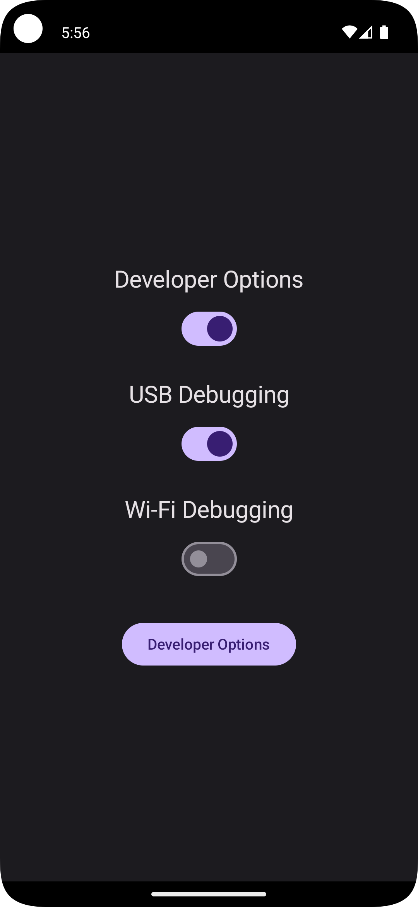

# Developer Options Toggle

A simple, robust Android utility to toggle Developer Options with a single click, helping you bypass security checks in apps like banking clients without the hassle of navigating through system settings.

## ✨ Features

* **One-Click Toggle:** A clean interface to view the current status of Developer Options and toggle it with a single switch.
* **Safe & Robust:** The app gracefully handles the required `WRITE_SECURE_SETTINGS` permission. If not granted, it disables the toggle and shows a clear warning message instead of crashing.
* **Home Screen Toggle Widget:** Add a widget to your home screen that shows the current status and lets you toggle the setting without even opening the app.
* **Quick Shortcut Widget:** Add a separate widget that acts as a simple shortcut to open the system's Developer Options screen directly.
* **Modern & Lightweight:** Built with 100% Kotlin, Jetpack Compose, and Material 3, with a dark mode-only theme and minimal impact on system resources.

## 📸 Screenshot



## 📋 Prerequisites

Before you begin, ensure you have the following:

1.  An Android device running **Android 10 (API 29)** or higher.
2.  A computer with **Android Debug Bridge (ADB)** installed and configured.

## 🚀 Getting Started

Because this app modifies a secure system setting, you **must** grant it a special permission via ADB. This is a one-time setup.

### 1. Installation

Install the application on your Android device. You can do this by downloading the latest `.apk` file from the [Releases](https://github.com/himphen/Developer-Options-Toggle/releases/) page.

### 2. Granting Permission

1.  Connect your device to your computer via USB.
2.  Open your terminal or command prompt.
3.  Run the following command:

    ```bash
    adb shell pm grant app.hibernatev2.developeroptionstoggle android.permission.WRITE_SECURE_SETTINGS
    ```

Once this is done, the app will have the necessary permission to function correctly.

## ⚙️ How to Use

1.  **In the App:** Open the app to see the current status. The toggle switch will be enabled if the permission has been granted. Use the button to jump directly to the system's Developer Options page.
2.  **On your Home Screen:** Long-press on your home screen and add the "Dev Opts Toggle" and "Dev Opts Shortcut" widgets for quick access.

## 🛠️ Tech Stack

* **Language:** [Kotlin](https://kotlinlang.org/)
* **UI:** [Jetpack Compose](https://developer.android.com/jetpack/compose) with Material 3
* **Widgets:** [Glance API](https://developer.android.com/jetpack/compose/glance) for AppWidgets
* **Build System:** Gradle with TOML Version Catalog

## License

This project is licensed under the MIT License. See the `LICENSE` file for details.
